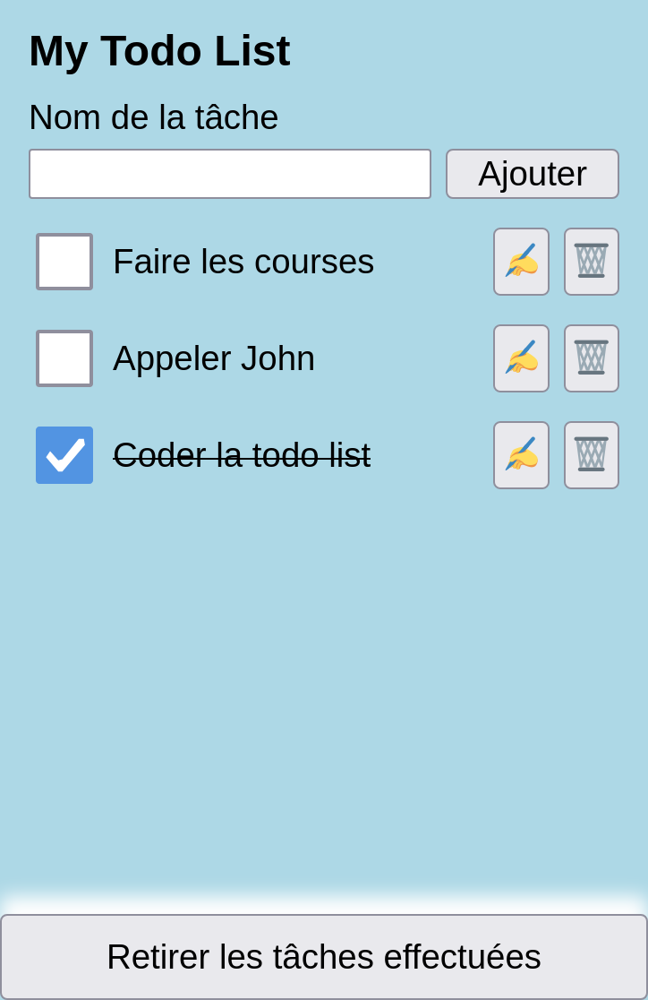

# TP Web Components

Le terme _Web Component_ regroupe trois technologies natives :

<ol>
  <li>Les <em>Custom Elements</em></li>
  <li>Le <em>Shadow DOM</em></li>
  <li>Les éléments HTML <code>&lt;template&gt;</code> et <code>&lt;slot&gt;</code> 
</ol>

Ces trois concepts seront introduits successivements par les trois exercices.

## 1. Les _Custom Elements_

Les _Custom Elements_ permettent de créer des éléments HTML sur mesure et de
définir leur contenu et leur comportement.

- Créez un fichier `index.html` avec une structure basique.
- Créez un fichier `src/current-time.js` et importez-le dans la balise `<head>`
  du fichier HTML. Utilisez l'attribut `defer` pour ne pas bloquer le parsing du
  fichier HTML.
- Ouvrez votre application dans le navigateur grâce à l'extension _Live Server_
  de _VSCode_ et vérifiez le bon lien entre les deux fichiers.

### Le composant `<current-time>`

Nous allons créer un composant affichant la date actuelle :


- Dans le fichier JavaScript, déclarez une classe `CurrentTime` qui étend la
  classe native `HTMLElement`.
- À la suite de la classe, grâce à la fonction
  `customElements.define("nom-du-tag", NomDeLaClasse)`, associez votre classe au
  tag `current-time`.
- Utilisez le tag `current-time` dans votre fichier HTML.
- Déclarez la méthode `connectedCallback` dans votre classe. Au sein de cette
  méthode, utilisez `this.innerHTML` pour ajouter du contenu à votre tag.

Le contenu doit s'afficher dans votre page.

### Affichage de l'heure

- Remplacez votre contenu de test par le vrai contenu, soit une div de classe
  `currentTime`, contenant :
  - un élément `<p>` de classe `currentTime__title` et contenant la chaîne
    `Heure locale` ;
  - un élément `<time>` de classe `currentTime__time`, vide.
- À la suite de cette opération, gardez une référence vers l'élément `<time>`
  dans la classe, nous en aurons besoin. Trouvez l'élément grâce à
  `this.querySelector` et stockez le dans `this.$time`.
- Insérez la date dans l'élément `<time>`. Elle peut être obtenue grâce à
  l'expression `new Date().toLocaleString()`.
- La date doit désormais s'afficher de manière statique (sans se mettre à jour).
- Ajoutez quelques styles via un fichier CSS global inclus dans `index.html`.

### Mise à jour automatique

On souhaite que la date se mette à jour à chaque seconde.

- Trouvez un moyen pour mettre à jour le contenu de `<time>` à chaque seconde
  (sans rafraîchir l'intégralité du contenu !)
- En utilisant la fonction `disconnectedCallback`, assurez-vous que la fonction
  de mise à jour ne sera plus appelée "dans le vide" après la disparition du
  composant. Pour le vérifier, vous pouvez supprimer le composant directement
  dans l'inspecteur et observer les effets (à l'aide de `console.log` par
  exemple).

### Paramètre UTC

Notre composant va désormais être capable d'accueillir un paramètre `format`. Si
ce format vaut `utc`, on souhaite afficher l'heure UTC. Pour toute autre valeur,
y compris l'absence de valeur, on reste sur le comportement initial (heure
locale).

- Dans votre HTML, ajoutez ce composant une deuxième fois, en passant cette
  fois-ci l'attribut `format="utc"`. Un deuxième composant (pour l'instant
  identique) apparaît.
- Dans votre fonction de rendu, utilisez `this.getAttribute("format")` pour
  adapter :
  - le titre du composant (`Heure UTC` ou `Heure locale`)
  - le contenu de l'élément `<time>` (`new Date().toUTCString()` ou
    `new Date().toLocaleString()`)

Les deux composants ont désormais un comportement différent !


### Prendre en compte la mise à jour de l'attribut UTC

Que se passe t-il lorsque vous inspectez le DOM et ajoutez / retirez
manuellement l'attribut `format="utc"` ?

Le format se met à jour (car il est recalculé à chaque seconde), mais pas le
titre !

Si l'on souhaite réagir aux changements d'attributs, des adaptations sont
nécessaires :

- Déclarez les attributs pris en compte par votre composant grâce à la variable
  `static observedAttributes`, qui doit être un tableau contenant le nom des
  attributs concernés.
- Grâce à la méthode `attributeChangedCallback(name, oldVal, newVal)`, lorsque
  vous détectez un changement sur l'attribut `format`, faites le nécessaire pour
  que la mise à jour soit correcte.

## 2. Le _Shadow DOM_

Le _Shadow DOM_ permet d'isoler le contenu d'un composant du reste de la page.
**Cela n'est pas toujours nécessaire**, mais peut être pratique dans certains
cas.

### Le composant `<screen-size>`

Le composant `<screen-size>` se comporte comme suit :

- il est flottant en haut à droite de l'écran
- il indique en permanence la largeur du viewport
- la largeur est indiquée en `px` ou en `rem`
- un bouton permet d'alterner entre les deux unités
- le composant accepte un attribut `unit` pour paramétrer son unité initiale (ou
  utilise la valeur `px` par défaut)
- on ne lui demande pas de réagir au changement de valeur de l'attribut `unit`
  par la suite

En voici un aperçu :


Construisez ce composant en vous inspirant du composant `<current-time>`, mais
cette fois-ci en utilisant le _Shadow DOM_ (soit en deux temps, soit
directement).

_Note : pour obtenir la largeur de la fenêtre en REM, vous pouvez utiliser
l'instruction suivante :_

```js
window.innerWidth /
  parseInt(getComputedStyle(document.body).getPropertyValue("font-size"));
```

### Spécificités du _Shadow DOM_

- Toujours `connectedCallback()`, le _Shadow DOM_ est crée grâce à l'instruction
  `this.attachShadow({ mode: "open" });`
- Les `querySelector` ne s'éxécutent plus sur `this` mais sur `this.shadowRoot`.

### _Shadow DOM_ et styles

Vous ne pouvez pas appliquer des styles depuis votre fichier global (essayez !).
Le _shadow DOM_ encapsule ses propres styles.

Vous devez donc déclarer les styles directement dans le template, avec une
balise `<style>` (par exemple injectée via `innerHTML`).

En contrepartie, les styles que vous déclarez dans un composant utilisant le
_shadow DOM_ ne peuvent pas "fuiter". Il est donc possible de se passer de
classes et de cibler les éléments HTML sans s'inquiéter de potentiels conflits.

Vous pouvez cibler l'élément qui contient le web component grâce au sélecteur
`:host`.

### _Shadow DOM_ et scripts

- Dans la console, cherchez les boutons présents sur la page :
  `document.querySelector("button")`. Qu'observez-vous ?
- Cherchez à présent
  `document.querySelector("screen-size").shadowRoot.querySelector("button")` et
  comparez le résultat.

## 3. Les éléments `<template>` et `<slot>`

### Préambule : l'élément `<details>`

Dans cette partie, nous ferons usage de l'élément HTML `<details>`. Sa
compréhension est requise pour la suite (lire la
[documentation MDN](https://developer.mozilla.org/en-US/docs/Web/HTML/Element/details)).

### La balise `<template>`

La balise `<template>` permet de définir un fragment de HTML, qui n'est pas
affiché de base dans la page mais dont on peut se servir pour créer des
composants.

Ajoutez le code suivant à votre fichier HTML :

```html
<template id="custom-details">
  <details>
    <summary>Cliquez pour ouvrir</summary>
    <div>Je suis le contenu détaillé</div>
  </details>
</template>
```

Comme vous pouvez le constater, le résultat n'est pas affiché dans le
navigateur.

### Le composant `<custom-details>`


Nous allons créer un composant `<custom-details>` qui étend le comportement de
base du composant `<details>` natif.

Comme précédemment, créez une classe `CustomDetails` et associez là au composant
`custom-details`.

Comme précédemment, au sein du constructeur, générez un _shadow DOM_.

Mais cette fois-ci, le contenu du composant n'est pas géré au sein de la classe.
Pour le récupérer, utilisez la ligne suivante :

```js
const template = document.getElementById("custom-details").content;
```

Puis attachez le contenu du template au _shadow DOM_ :

```js
this.shadowRoot.appendChild(template.cloneNode(true));
```

En ajoutant un élément `<custom-details>` à la page, vous devriez désormais voir
le contenu du template.

Complétez le code de la classe pour mettre en place les interactions suivantes :

- ouverture de l'élément au survol
- ouverture de l'élément au focus
- fermeture de l'élément à l'appui sur la touche Échap

### Les `<slots>`

Les `<slots>` vont permettre de passer du contenu complexe de l'extérieur vers
l'intérieur du composant.

Dans notre cas, il faut en effet passer le contenu du tag `<summary>` (qui peut
être une simple `string`) et le contenu dévoilé (qui est souvent un contenu plus
complexe).

Dans un template, il est possible d'ajouter un _slot_ de cette façon :

```html
<template>
  ...
  <slot name="summary"></slot>
  ...
</template>
```

À cet endroit sera inséré l'élément associé de cette façon :

```html
<custom-details>
  <span slot="summary">Les 3 technologies des Web Components</span>
</custom-details>
```

Ajoutez les _slots_ `summary` et `content`. Pour l'exemple, passez une liste
`<ul>` en contenu.

Vérifiez le bon fonctionnement.

### _Slots_ et styles

Stylisez le composant final en tenant compte des informations suivantes
(effectuez des tests au fur et au mesure) :

- Une balise `<style>` insérée au sein de la balise `<template>` permet de
  styliser le _shadow DOM_.
- Les éléments _slottés_ ne font pas partie du _shadow DOM_. Ainsi, ils ne sont
  pas impactés par les styles du composant, mais ils sont impactés par les
  styles globaux de la page.
- Entre ces deux concepts, il est possible de cibler des éléments _slottés_ dans
  les styles du _shadow DOM_. Par exemple, le sélecteur `::slotted(ul)` cible
  les listes `ul` qui sont _slottées_ dans le composant.
- Les enfants de composants _slottés_ restent, eux, innaccessible.

## Projet final : la Todo List

L'objectif est de réaliser une Todo List de ce type :



### Contraintes techniques

- Vous pouvez utiliser ou non le _shadow DOM_, selon ce qui vous parle le plus ;
- Découpage en plusieurs composants ;
- Le style est libre (mais il en faut un minimum !) ;
- Mobile first (styles pour écrans élargis optionnels) ;
- Le résultat devra être accessible. Testez pour cela (ordre recommandé) :
  - Le résultat du plugin axe DevTools
  - La navigation clavier
  - Le lecteur d'écran de votre système

C'est une application simple mais il peut y avoir beaucoup de subtilités au
niveau des interactions. Prenez le temps d'aller au fond du sujet.

Vous pouvez [voir mon implémentation ici](https://todolist-wc.netlify.app/).
Mais ne copiez pas son code, cela n'aurait pas d'intérêt !

#### Le Store

Pour commencer votre implémentation, ne vous pré-occupez pas du stockage : vos
todos seront effacées à chaque rechargement.

Il vous faudra quand même dès le départ une méthode pour que tous vos composants
puissent partager la même liste de todos.

Pour cela, une méthode courante est l'utilisation d'un `Store`, en l'occurence
une simple classe qui sera chargée de stocker et fournir la liste des todos, une
todo spécifique, le nombre de todos restantes, etc... Un peu comme une base de
données qui ne vit que le temps de la page.

Voici un coup de pouce pour le départ. Dans un fichier `store.js`, ajoutez le
code suivant :

```js
class Store {
  constructor() {
    this.todos = [];
  }

  getTodos() {
    return this.todos;
  }
}

export const store = new Store();
```

Vous avez désormais accès à la variable `store`, une instance unique de la
classe `Store` au travers de l'application.

Dans un composant, vous pouvez l'appeler ainsi :

```js
import { store } from "./store.js";

// Plus loin, dans votre composant...
store.getTodos();
```

Il vous faudra ajouter toutes les fonctions nécessaires à votre `Store`, et
trouver comment faire en sorte que les composants puissent réagir aux changement
dans la liste des todos !

#### Stockage des données en local

La touche finale, sans quoi votre application n'est pas très utile : stocker la
liste en local.

Au moins deux approches sont possible :

- `localStorage` : il s'agit alors d'utiliser `JSON.stringify()` et
  `JSON.parse()` pour convertir les objets à stocker en `string` (seul format
  supporté par `localStorage`). Basique, mais ça fait le job !
- `IndexedDB` : une vraie base de données, performante et aynchrone, directement
  dans le navigateur, avec stockage d'objets complexes. Si vous vous sentez
  d'essayer, ça vaut le coup !
